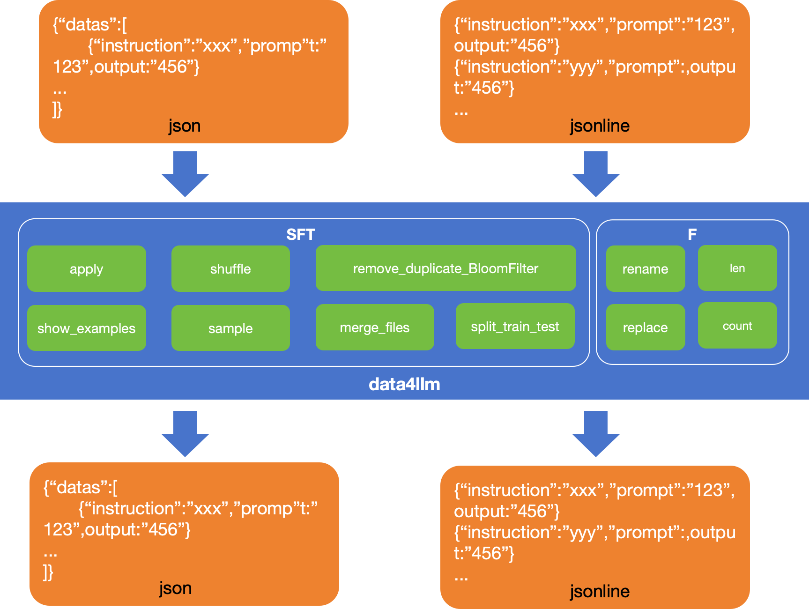
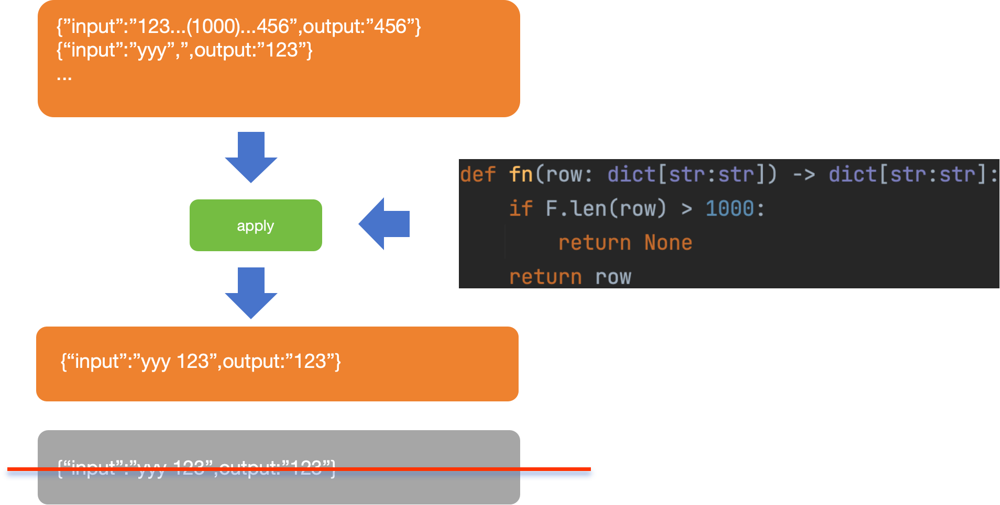
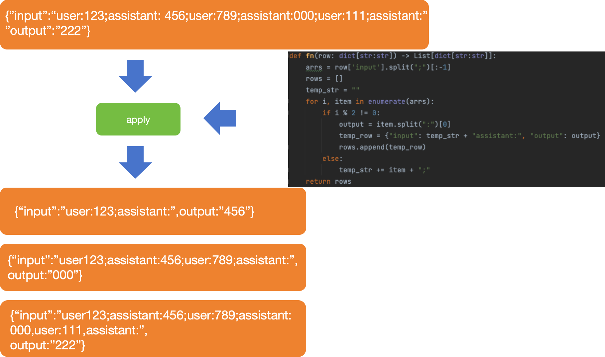

# Data4LLM
<div align="center"> 
<a href="https://github.com/SWEENEYHE/Data4LLM/blob/main/LICENSE.txt">

</a>
<a href="https://pypi.org/project/data4llm/0.3.0/">

</a>
</div>

### The simple and useful data process tool for LLM `data4llm`
`data4llm` is a json & jsonline process tool, which runs well in millions number level, which facilitates the construction procession of millions of data to continue-pretrain and finetune your LLM. The current framework show below:

# install
```
pip install data4llm
```
# API
## SFT
```python
from data4llm.Data4LLM import SFT
```

### 1.For file level
#### (1) merge files
merge all the jsonlines files with shuffle
```python
import glob
from data4llm import Data4LLM

files = glob("dir/*.jsonl")
Data4LLM.merge_files(files=files)
```
#### (2) split files to train and test file

```python
from data4llm.Data4LLM import SFT

SFT.split_train_test(file_input="data/test.jsonl", train_ratio=3 / 5)
```
### 2. For sample level
Every sample is a json with key-value like dict[str:str], for example:
````
 {"input":"hello!","output":"Hi, I'm an AI assistant, how can I help you?"}
````
#### (1) shuffle
shuffle all the samples in a file, it doesn't optimize the memory usage now, requiring to load all the data to memory in one time

```python
from data4llm.Data4LLM import SFT

SFT.shuffle(file_input="data/test.txt", file_output="result/sh_test.jsonl")
```
````
def shuffle(cls, file_input, file_output):
    shuffle: shuffle all the data in input file. warning: it loads all the data in memory
    ile_input: input file path
    file_output: output file path
````

#### (2) remove duplicated data
remove duplicate data by sim_hash. There are two function `remove_duplicate_BloomFilter` and `remove_duplicate`.

`remove_duplicate_BloomFilter` : remove duplicate data by sim_hash, which removes data by bloom filter, very fast

```python
from data4llm.Data4LLM import SFT
SFT.remove_duplicate_BloomFilter(file_input="data/test.jsonl", file_output="result/rm_dup_test.json", length=64)
```
````
def remove_duplicate_BloomFilter(cls, file_input, file_output, max_row_limit=1000, skip_hash=False, length=64,
                                 log_path="result.log"):
    '''
        remove_duplicate : remove duplicate data by sim_hash, which removes data by bloom filter, very fast
        file_input: input file path with duplicated data
        file_output: result file path
        max_row_limit: the max data number in memory which is useful to save memory
        skip_hash: default false. it needed when call the function in first time, which is used to get the simhash in all the data
        length: the simhash length
        log_path: log file path
        :return: result data number , removed data number
    '''
````
`remove_duplicate` : remove duplicate data by sim_hash, which compares data one by one, getting more accurate and finely result but costing massive time

```python
from data4llm.Data4LLM import SFT

SFT.remove_duplicate(file_input="data/test.jsonl", file_output="result/rm_dup_test.json", length=64)
```
````

def remove_duplicate(cls, file_input, file_output, ratio=1, max_row_limit=1000, skip_hash=False, length=64,
                 log_path="result.log"):
    remove_duplicate : remove duplicate data by sim_hash, which compares data one by one, getting more accurate and finely result but costing massive time
    file_input: input file path with duplicated data
    file_output: result file path
    ratio: threshold for duplication, which is actually the distance of the two simhash value
    max_row_limit: the max data number in memory which is useful to save memory
    skip_hash: default false. it needed when call the function in first time, which is used to get the simhash in all the data
    length: the simhash length
    log_path: log file path
    :return: result data number , removed data number
````

#### (3) apply
The most powerful function in this project, you can apply any process rule by it ,including: `process property`(`rename`, `remove`, `add`), `process content`(`remove chars`, `replace chars`), `filter` sample by some rules, `derived` serval samples from a sample.
There are three typical ways: `I.filter`, `II.process attributes`, `III.from one to serval`:
#### I. filtered by length
Filter sample by returning `None`


```python
def fn(row: dict[str:str]) -> dict[str:str]:
    if F.len(row) > 1000:
        return None
    return row

SFT.apply(file_input="data/test.txt", file_output="result/result_test.jsonl", fn=fn)
```
#### II. concat two properties into one
apply process to every sample

```python
from data4llm.Data4LLM import SFT, F

def fn(row: dict[str:str]) -> dict[str:str]:
    row['input'] = row['instruction']+row['prompt']
    row.pop("instruction")
    row.pop("prompt")
    return row


SFT.apply(file_input="data/test.txt", file_output="result/result_test.jsonl", fn=fn)
```

#### III. from one to several
Generate more samples from one sample by returning a list consisting of dict


```python
def fn(row: dict[str:str]) -> List[dict[str:str]]:
    arrs = row['input'].split(";")[:-1]
    rows = []
    temp_str = ""
    for i, item in enumerate(arrs):
        if i % 2 != 0:
            output = item.split(":")[0]
            temp_row = {"input": temp_str + "assistant:", "output": output}
            rows.append(temp_row)
        else:
            temp_str += item + ";"
    return rows

SFT.apply(file_input="data/test.txt", file_output="result/result_test.jsonl", fn=fn)
```
#### The apply function 
````
def apply(cls, file_input, file_output, fn, max_row_limit=1000, json=None):
    apply_property: apply the json row one by one, including: rename property, remove property, apply content(remove chars, replace chars)
     file_input: input file path
     file_output: output file path
     fn: apply function
     max_row_limit: default=1000, every step to write file and max data num in memory
     json: default=None, it determines json or jsonline, or True/False
````


#### (4) show_example
It is very useful to show the result before actually conduct it by `show_example`:
```python
from data4llm.Data4LLM import SFT
def fn(row):
    row['input'] = row['input'].replace("https://www.baidu.com")
    return row
SFT.show_example(file_input="data/test.txt", fn=fn)
```
examples:
````
##### No 1 #####
== Before ==
{'input': 'welcome to https://www.baidu.com #LLM world', 'output': 'I like #LLM'}
== After ==
{'prompt': 'welcome to  LLM world', 'chosen': 'I like LLM'}
##### No 2 #####
== Before ==
{'input': 'hello!', 'output': "Hi, I'm an AI assistant, how can I help you?"}
== After ==
{'prompt': 'hello!', 'chosen': "Hi, I'm an AI assistant, how can I help you?"}
````
```
def show_example(cls, file_input, fn, json=None, s=0, e=5):
    '''
    file_input: 
    fn: 
    json: if the file is json or jsonline, default None means it decided by the postfix of th file_input 
    s: default 0 the start row num
    e: default 5 the end row num
    :return: None
    '''
```
## PT
```python
from data4llm.Data4LLM import PT
```

#### (1)  show_properties
show the json structure
```python
def show_properties(cls, files, s=0, e=5):
        '''
        show the json structure
        :param files:
        :param s:
        :param e:
        :return:
        '''
```

#### (2) parse_pages
parse the semi structure json and parse all the token needed together for PT
```python
def parse_pages(cls, files, fn, output_dir):
        '''
        parse the semi structure json and parse all the token needed together fot PT
        :param files:
        :param fn:
        :param output_dir:
        :return:
        '''
```
#### (3) merge_files
  merge all the txt files
````python
def merge_files(cls, files, output_file="merge_file.txt", max_limit_num=100):
    '''
    merge all the txt files
    :param files: 
    :param output_file: 
    :param max_limit_num: 
    :return: 
    '''
````
#### (4) split_train_test
split a file into train and test files
```python 
def split_train_test(cls, file_input, train_test_ratio, file_train_output="train.txt", file_test_output="test.txt"):
    '''
    split a file into train and test files
    :param file_input: 
    :param train_test_ratio: 
    :param file_train_output: 
    :param file_test_output: 
    :return: 
    '''
```
#### (5) sample
sample 
## F
A tool class with some useful functions
```python
from data4llm.Data4LLM import F
```
### (1) count
get the sample number of a file
```python
def count(cls, file_input):
    """
    get the sample number of a file
    :param file_input:
    :return:
    """
```
### (2) functions used in `apply` fn
`rename()` : rename the property of every sample \
`repalce()`: replace the chars in a json or a property in the json \
`len()`: get the length of the json (only values) of part of json (specify the property like "chosen" only {"chosen"})
```python
def rename(cls, row, mapping: dict[str:str]) -> None
def replace(cls, row, pattern, repl, property=None) -> None
def len(cls, row, property=None) -> int:
```


